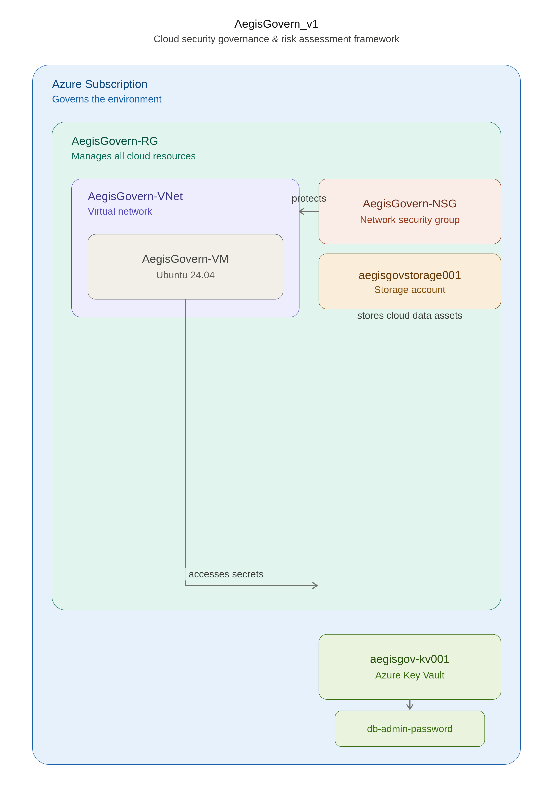

# AegisGovern_v1

Cloud Security Governance & Risk Assessment Framework for Microsoft Azure

## Overview

AegisGovern_v1 is a cloud governance, risk assessment, and security control validation project developed within Microsoft Azure as part of the THRAGG cybersecurity portfolio.

The project simulates the responsibilities of a Cloud Security Analyst by conducting asset discovery, risk identification, governance reviews, access control assessments, compliance mapping, and executive-level reporting.

---

## Architecture



---

## Assessment Metrics

| Metric                         | Value |
| ------------------------------ | ----- |
| Assets Assessed                | 7     |
| Findings Identified            | 9     |
| Security Controls Validated    | 5     |
| Compliance Frameworks Reviewed | 2     |
| Azure Services Reviewed        | 6     |

---

## Environment

### Azure Resources

* AegisGovern-RG
* AegisGovern-VNet
* Default Subnet
* AegisGovern-NSG
* AegisGovern-VM
* aegisgovstorage001
* aegisgov-kv001

Region:

* Central India

---

## Security Assessments Performed

### Asset Inventory

Documented cloud resources and assigned ownership and criticality ratings.

### Risk Assessment

Identified governance and security risks including:

* SSH Exposure
* Public Storage Access
* Excessive Privileges
* Public Key Vault Exposure

### Control Assessment

Validated:

* SSH Key Authentication
* Network Security Group Controls
* Network Segmentation
* Storage Encryption
* Azure Key Vault Secret Management

### Compliance Mapping

Mapped controls against:

* NIST Cybersecurity Framework (CSF)
* CIS Controls

---

## Findings Overview

| Finding                             | Severity | Status    |
| ----------------------------------- | -------- | --------- |
| SSH Brute Force Exposure            | Medium   | Open      |
| Public Storage Access               | Medium   | Open      |
| Key Vault Public Access             | Medium   | Open      |
| Excessive Privilege Assignment      | Medium   | Open      |
| Secrets Stored Outside Secure Vault | Medium   | Mitigated |
| Key Vault RBAC Misconfiguration     | Low      | Resolved  |

---

## Evidence

Project evidence is available in the `evidence/` directory.

* Architecture Diagram
* Resource Group Overview
* VM Overview
* NSG Configuration
* Storage Configuration
* Key Vault Configuration
* Secret Creation Validation
* Project Structure

---

## Assessment Artifacts

The project includes the following governance and security assessment deliverables:

* Asset Inventory
* Risk Register
* Control Assessment
* Compliance Mapping
* Risk Scoring Methodology
* MITRE ATT&CK Mapping
* Remediation Plan
* Executive Assessment Report

These artifacts simulate documentation commonly produced during cloud security reviews, governance assessments, and risk management engagements.

---

## Assessment Methodology

The assessment followed a governance-focused cloud security review process:

1. Asset Identification
2. Risk Assessment
3. Security Control Validation
4. Compliance Mapping
5. MITRE ATT&CK Mapping
6. Remediation Planning
7. Executive Reporting

This methodology mirrors activities performed by cloud security analysts and governance teams when evaluating cloud environments against security best practices.

---

## Technologies Used

* Microsoft Azure
* Azure Virtual Machines
* Azure Networking
* Azure RBAC
* Azure Key Vault
* Azure Storage Account
* Ubuntu Linux
* SSH
* NIST CSF
* CIS Controls

---

## Project Structure

```text
AegisGovern_v1/
├── assets/
├── evidence/
├── findings/
├── reports/
├── docs/
└── scripts/
```

---

## THRAGG Integration

AegisGovern_v1 provides governance, compliance, and risk context to the THRAGG Unified Threat Orchestration Platform.

```text
CyberReconLab_v1
        ↓
SentinelForge_v1
        ↓
AegisGovern_v1
        ↓
THRAGG
```

---

## Author

B. Giri Anoop

Cybersecurity Portfolio Project | THRAGG Series
